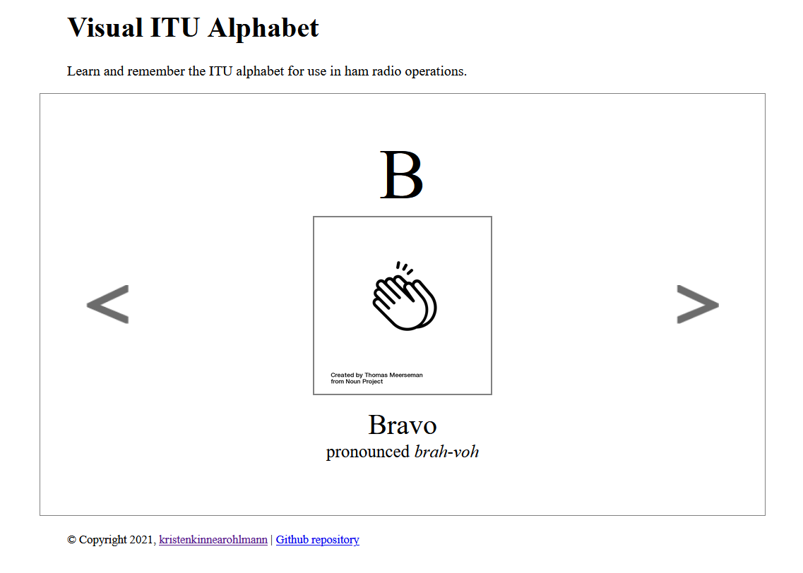

# Visual ITU Alphabet

Amateur (ham) radio operators need to know their ITU alphabet to communicate appropriately. Over the past decade, I have found I can imperfectly recall the proper words for each letter. This resource helps people remember the letter by including an image to associate with the word.

If you have been looking for a source that helps you better learn and remember the ITU alphabet for use in ham radio operations - it's here!

Dedicated to Dad (KD0NPJ) and Leah L, whose dad talks to her in ITU letters.

## Install Instructions

This is a basic HTML, CSS and Javascript app. No installation is required beyond a browser that has enabled and supports these 3 technologies.

To run locally, simply open `index.html` in your browser of choice.

## Contributor's Guide

Thank you for your interest in contributing to this project. Contributions are expected to be thoughtful, kind, explore new possibilities and add value to the application for all users.

If you have an idea or issue fix that you have not seen contributed or completed, please open a pull request with a meaningful message for review.

You will need to install the project, following the installation instructions, to ensure you are able to view and work with the source code.

## License

This application carries an [MIT License](https://github.com/kristenkinnearohlmann/itu-alpha/blob/main/LICENSE)